# SVG学习笔记

------
## 入门
### 简单的示例
```xml
<svg version="1.1"
    baseProfile="full"
    width="300" height="200"
    xmlns="http://www.w3.org/2000/svg">
    <rect width="100%" height="100%" fill="red"/>

    <circle cx="150" cy="100" r="80" fill="green" />

    <text x="150" y="125" font-size="60" text-anchor="middle" fill="white">SVG</text>
</svg>
```
效果如下：

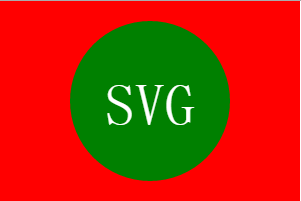

#### 注意
> * 属性version和属性baseProfile属性是必不可少的，供其它类型的验证方式确定SVG版本
> * 作为XML的一种方言，SVG必须正确的绑定命名空间

### SVG文件的基本属性
1. SVG文件全局有效的规则是“后来居上”，越后面的元素越可见。
2. web上的svg文件可以直接在浏览器上展示，或者通过以下几种方法嵌入到HTML文件中：
    - 如果HTM是XHTML并且声明类型为application/xhtml+xml，可以直接把SVG嵌入到XML源码中
    - 如果HTML是HTML5并且浏览器支持HTML5，同样可以直接嵌入SVG。
    - 可以通过object元素引用SVG文件：
        ```xml
        <object data="image.svg" type="image/svg+xml" />
        ```
    - 可以使用iframe元素引用SVG文件：
        ```xml
        <iframe src="image.svg"></iframe>
        ```

### SVG坐标定位
> * 这种坐标系统是：以页面的左上角为(0,0)坐标点，坐标以像素为单位，x轴正方向是向右，y轴正方向是向下

下面的代码定义的画布尺寸为200\*200，viewBox属性定义了画布上可以显示的区域：从（0，0）开始，150\*100 ，于是形成了放大两倍的效果
```xml
<svg width="200" height="200" viewBox="0 0 100 100">
```
源代码：[demo1.svg](demo/demo1.svg)

2015年12月21日

## 填充和边框
### Fill和Stroke属性
#### 1. 上色
> * fill属性设置对象内部的颜色
> * stroke设置绘制对象的线条的颜色
> * fill-opacity控制填充色的不透明度
> * stroke-opacity控制描边的不透明度

```xml
<rect x="10" y="10" width="100" height="100" stroke="blue" fill="purple" fill-opacity="0.5" stroke-opacity="0.8" />
```
效果如下：

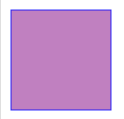

#### 2. 描边
除了颜色属性，还有其他一些属性用来控制绘制描边的方式
> * stroke-width属性定义了描边的宽度，描边是以路径为中心线绘制的
> * stroke-linecap属性控制边框终点的形状
    - butt用直边结束线段，它是常规做法，线段边界90度垂直于描边的方向，贯穿它的终点
    - square的效果差不多，但是会稍微超出实际路径范围，超出的大小有stroke-width控制
    - round表示边框的终点是圆角，圆角的半径也是由stroke-width控制的
> * stroke-linejoin属性控制两条描边线段之间，用什么方式连接
    - miter是默认值，表示用方形画笔在连接处形成尖角
    - round表示圆角连接，实现平滑效果
    - bevel连接处会形成一个斜接
> * stroke-dasharray属性可以将边框定义为虚线

##### 2.1 stroke-linecap示例
```xml
<line x1="40" x2="120" y1="20" y2="20" stroke="black" stroke-width="20" stroke-linecap="butt" />
<line x1="40" x2="120" y1="60" y2="60" stroke="black" stroke-width="20" stroke-linecap="square" />
<line x1="40" x2="120" y1="100" y2="100" stroke="black" stroke-width="20" stroke-linecap="round" />
```
效果如下：

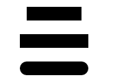

##### 2.2 stroke-linejoin示例
```xml
<polyline points="40 260 80 220 120 260" stroke="black" stroke-width="20" stroke-linecap="butt" fill="none" stroke-linejoin="miter" />
<polyline points="40 340 80 300 120 340" stroke="black" stroke-width="20" stroke-linecap="round" stroke-linejoin="round" fill="none"/>
<polyline points="40 420 80 380 120 420" stroke="black" stroke-width="20" fill="none" stroke-linecap="square" stroke-linejoin="bevel"/>
```
效果如下：

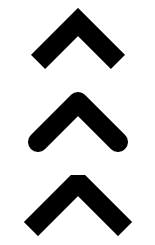

##### 2.3 stroke-dasharray示例
```xml
<path d="M 10 500 Q 50 400 100 500 T 190 500" stroke="black" stroke-linecap="round" stroke-dasharray="5,15,5" fill="none" />
<path d="M 10 500 L 190 500" stroke="red" stroke-linecap="round" stroke-width="1" stroke-dasharray="5,5" fill="none"/>
```
效果如下：

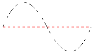

> * stroke-dasharray属性的参数，是一组用逗号分割的数字组成的数列。注意，和path不一样，这里的数字必须用逗号分割，虽然也可以插入空格，但是数字之间必须用逗号分开。每一组数字，第一个用来表示实线，第二个用来表示空白。所以在上面的例子里，第二个路径会先画5px实线，紧接着是5px空白，然后又是5px实线，从而形成虚线。如果你想要更复杂的虚线模式，你可以定义更多的数字。上面例子里的第一个，就定义了3个数字，这种情况下，数字会循环两次，形成一个偶数的虚线模式。所以该路径首先是5px实线，然后是10px空白，然后是5px实线，接下来循环这组数字，形成5px空白、10px实线、5px空白。然后这种模式会继续循环.

### 使用CSS
> * 除了定义对象的属性外，你也可以通过CSS来样式化填充和描边。语法和在html里使用CSS一样，只不过你要把background-color、border改成fill和stroke。注意，不是所有的属性都能用CSS来设置。上色和填充的部分一般是可以用CSS来设置的，比如fill，stroke，stroke-dasharray等，但是不包括下面会提到的渐变和图案等功能。另外，width、height，以及路径的命令等等，都不能用css设置
> * 可以通过内联样式或者引用外部样式文件来设置

源代码：[demo2.svg](demo/demo2.svg)

2015-12-22

## 渐变
有两种类型的渐变：线性渐变和径向渐变。必须给渐变内容指定一个id属性，否则文档内的其他元素就不能引用它。为了使渐变能被重复使用，渐变内容需要定义在**&lt;defs>**标签内部，而不是定义在形状上面。

### 线性渐变
线性渐变沿着直线改变颜色，要插入一个线性渐变，你需要在SVG文件的defs元素内部，创建一个&lt;linearGradient>节点。

基本示例：
```xml
<svg version="1.1"
    width="120"
    height="240"
    xmlns="http://www.w3.org/2000/svg">
    <defs>
        <linearGradient id="Gradient1">
            <stop class="stop1" offset="0%"/>
            <stop class="stop2" offset="50%" />
            <stop class="stop3" offset="100%" />
        </linearGradient>
        <linearGradient id="Gradient2" x1="0" x2="0" y1="0" y2="1" >
            <stop offset="0%" stop-color="red" />
            <stop offset="50%" stop-color="black" stop-opacity="0" />
            <stop offset="100%" stop-color="blue" />
        </linearGradient>
        <style type="text/css">
            <![CDATA[
            #rect1 {fill: url(#Gradient1);}
            .stop1 {stop-color:red;}
            .stop2 {stop-color:black;stop-opacity:0;}
            .stop3{stop-color:blue;}
            ]]>
        </style>
    </defs>

    <rect id="rect1" x="10" y="10" rx="15" ry="15" width="100" height="100" />
    <rect x="10" y="120" rx="15" ry="15" width="100" height="100" fill="url(#Gradient2)" />
</svg>
```
显示效果：
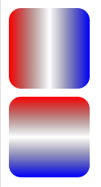

这些结点通过指定位置的offset（偏移）属性和stop-color（颜色中值）属性来说明在渐变的特定位置上应该是什么颜色；可以直接指定这两个属性值，也可以通过CSS来指定他们的值，该例子中混合使用了这两种方法。例如：该示例中指明了渐变开始颜色为红色，到中间位置时变成半透明的黑色，最后变成蓝色。虽然你可以根据需求按照自己的喜好插入很多中间颜色，但是偏移量应该始终从0%开始（或者0也可以，百分号可以扔掉），到100%（或1）结束。如果stop设置的位置有重合，将使用XML树中较晚设置的值。而且，类似于填充和描边，你也可以指定属性stop-opacity来设置某个位置的半透明度
使用渐变时，我们需要在一个对象的属性fill或属性stroke中引用它，这跟你在CSS中使用url引用元素的方法一样。在本例中，url只是一个渐变的引用，我们已经给这个渐变一个ID——“Gradient”。要想附加它，将属性fill设置为url(#Gradient)即可。现在对象就变成多色的了，也可以用同样的方式处理stroke。
&lt;linearGradient>元素还需要一些其他的属性值，它们指定了渐变的大小和出现范围。渐变的方向可以通过两个点来控制，它们分别是属性x1、x2、y1和y2，这些属性定义了渐变路线走向。渐变色默认是水平方向的，但是通过修改这些属性，就可以旋转该方向。下例中的Gradient2创建了一个垂直渐变。

### 径向渐变
径向渐变与线性渐变相似，只是它是从一个点开始发散绘制渐变。创建径向渐变需要在文档的defs中添加一个&lt;radialGradient>元素

示例：
```xml
<radialGradient id="RadialGradient1">
    <stop offset="0%" stop-color="red" />
    <stop offset="100%" stop-color="blue" />
</radialGradient>
<radialGradient id="RadialGradient2" cx="0.25" cy="0.25" r="0.25">
    <stop offset="0%" stop-color="red" />
    <stop offset="100%" stop-color="blue" />
</radialGradient>
<rect x="10" y="230" rx="15" ry="15" width="100" height="100" fill="url(#RadialGradient1)" />
<rect x="10" y="370" rx="15" ry="15" width="100" height="100" fill="url(#RadialGradient2)" />
```
显示效果：

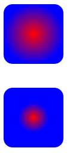
2015-12-23
径向渐变也是通过两个点来定义其边缘位置，两点中的第一个点定义了渐变结束所围绕的圆环，它需要一个中心点，由cx和cy属性及半径r来定义，通过设置这些点我们可以移动渐变范围并改变它的大小，如上例的第二个<rect>所展示的。

第二个点被称为焦点，由fx和fy属性定义。第一个点描述了渐变边缘位置，焦点则描述了渐变的中心，如下例.
```xml
<radialGradient id="RadialGradient3" cx="0.5" cy="0.5" r="0.5" fx="0.25" fy="0.25">
    <stop offset="0%" stop-color="red" />
    <stop offset="100%" stop-color="blue" />
</radialGradient>
<rect x="10" y="450" rx="15" ry="15" width="100" height="100" fill="url(#RadialGradient3)" />
<circle cx="60" cy="500" r="50" fill="transparent" stroke="white"  stroke-width="2"/>
<circle cx="35" cy="475" r="2" fill="white" stroke="white" />
<circle cx="60" cy="500" r="2" fill="white" stroke="white" />
<text x="38" y="480" fill="white"  font-family="sans-serif" font-size="10pt">(fx,fy)</text>
<text x="63" y="503" fill="white"  font-family="sans-serif" font-size="10pt">(cx,cy)</text>
```
显示效果：

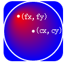

源代码：[demo3.svg](demo/demo3.svg)
2015-12-24

## 图案
图案用patterns标签，需要放在SVG文档的defs内部
```xml
<svg  version="1.1"
    width="200"
    height="200"
    xmlns="http://www.w3.org/2000/svg">
<defs>
    <linearGradient id="Gradient1">
      <stop offset="5%" stop-color="white"/>
      <stop offset="95%" stop-color="blue"/>
    </linearGradient>
    <linearGradient id="Gradient2" x1="0" x2="0" y1="0" y2="1">
      <stop offset="5%" stop-color="red"/>
      <stop offset="95%" stop-color="orange"/>
    </linearGradient>

    <pattern id="Pattern" x="0" y="0" width=".25" height=".25">
      <rect x="0" y="0" width="50" height="50" fill="skyblue" />
      <rect x="0" y="0" width="25" height="25" fill="url(#Gradient2)"/>
      <circle cx="25" cy="25" r="20" fill="url(#Gradient1)" fill-opacity="0.5"/>
    </pattern>
</defs>

<rect fill="url(#Pattern)" stroke="black" x="0" y="0" width="200" height="200"/>
</svg>
```
显示效果：

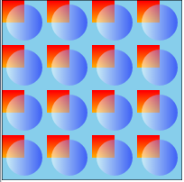

源代码: [demo4.svg](demo/demo4.svg)

在pattern元素内部可以包含任何之前包含过的其他基本形状，并且每个形状都可以使用之前学习过的任何样式样式化。pattern定义了一个单元系统以及他们的大小。更高级的属性后期需要的时候再查看，在这里就不写了。

## Texts
在SVG中有两种截然不同的文本模式。一种是写在图像中的文本，另一种是SVG字体。关于后者在后面进行，主要集中前者：写在图像中的文本。
### 基础
在一个SVG文档中，&lt;text>元素内部可以放任何的文字。
    <text x="10" y="10">Hello world!</text>
> * 属性x和属性y决定文本在视口显示的位置
> * 属性text-anchor，可可以有这些值：start,middle,end或inherit,允许决定从这一点开始的文本流的方向
> * 属性fill可以给文本填充颜色，属性stroke可以给文本描边
> * 也可以引用渐变或图案
### 设置字体属性
SVG提供的属性和css类似，提供的属性有：font-family、font-style、font-weight、font-variant、font-stretch、font-size、font-size-adjust、kerning、letter-spacing、word-spacing和text-decoration。
### 其它文本相关的元素
#### tspan
该元素用来标记大块文本的子部分，它必须是一个text元素或别的tspan元素的子元素。一个典型的用法是把句子中的一个词变成粗体红色。
```xml
<text>
this is very
    <tspan font-weight="bold" fill="red" >important</tspan>
thing
</text>
```
显示效果：

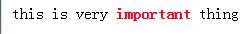

tspan元素由以下自定义属性：
> * x 为容器设置一个新绝对x坐标。它覆盖默认的当前的文本位置。这个属性可以包含一个数列，它们将一个一个应用到每一个字符上，对应的还有y属性。
> * dx 从当前位置，用一个水平偏移开始绘制文本，对应的还有dy属性
> * rotate 把所有的字符旋转一个角度。如果是一个数列，则使每个字符分别旋转，剩下的字符根据最后一个值旋转。
> * textLength 给出字符串的计算长度。它意味着如果它自己的度量文字和长度不满足这个提供的值，则永允许渲染引擎精细调整字型的位置。
    <text x="10" y="110" textLength="100">this is as</text>
    <text x="10" y="130" textLength="100">this aas</text>
显示效果：

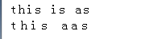

#### tref 
该元素允许引用已经定义的文本，高效地把它复制到当前位置。你可以使用xlink:href属性，把它指向一个元素，取得其文本内容。你可以独立于源样式化它，修改它的外观。
```xml
<text id="example">This is an example text.</text>
<text>
    <tref xlink:href="#example" />
</text>
```

#### textPath 
该元素利用xlink:href属性取得一个任意路径，把字符对齐到路径，于是字体会环绕路径、顺着路径走。(chrome浏览器不能识别xlink:href)
```xml
<path id="my_path" d="M 20,20 C 40,40 80,40 100,20" />
<text>
  <textPath xlink:href="#my_path">This text follows a curve.</textPath>
</text>
```
源代码: [demo5.svg](demo/demo5.svg)

## 基本变形
现在我们准备好开始扭曲我们美丽的图像了。但是首先，让我们正式地介绍<g>元素。利用这个助手，你可以把属性赋给一整个元素集合。实际上，这是它唯一的目的。一个示例：
```xml
<g>
    <rect x="0" y="0" width="10" height="10" />
    <rect x="20" y="0" width="10" height="10" />
</g>
```
输出两个黑色矩形
所有接下来的变形都会用一个元素的transform属性总结。变形可以连缀，只要把它们连接起来就行，用空格隔开

### 平移
能把元素移动一段距离，甚至你可以根据相应的属性定位它。translate()变形方法专门效力于这个目的。
```xml
<rect x="0" y="0" width="10" height="10" transform="translate(30,40)" />
```
该示例将呈现一个矩形，移到点(30,40)，而不是出现在点(0,0)。

如果没有指定第二个值，它默认被赋值0.
### 旋转
旋转一个元素是相当常见的任务。使用rotate()变形就可以了：
```xml
<rect x="0" y="0" width="10" height="10" transform="rotate(45)" />
```

2015-12-26
### 斜切
利用一个矩形制作一个斜菱形。可用skewX()变形和skewY()变形。每个需要一角度以确定元素斜切到多远。
###  缩放
scale()变形改变了元素的尺寸。它需要两个数字，作为比率计算如何缩放。0.5表示收缩到50%。如果第二个数字被忽略了，它默认等于第一个值。
### 用matrix()实现复杂变形
所有上面的变形可以表达为一个2x3的变形矩阵。组合一些变形，可以直接用matrix(a, b, c, d, e, f)变形设置结果矩阵，利用下面的矩阵，它把来自上一个坐标系统的坐标映射到新的坐标系统：
### 坐标系统上的效果
如果使用了变形，你会在元素内部建立了一个新的坐标系统，应用了这些变形，你为该元素和它的子元素指定的单位可能不是1:1像素映射。但是依然会根据这个变形进行歪曲、斜切、转换、缩放操作。
### SVG嵌在SVG内部
比之HTML，SVG允许你无缝嵌入别的svg元素。因此你可以利用内部svg元素的属性viewBox、属性width和属性height简单创建一个新的坐标系统

源代码：[demo6.svg](demo6.svg)

## 剪切和遮罩
> * Clipping用来移除在别处定义的元素的部分内容。在这里，任何半透明效果都是不行的。它只能要么显示要么不显示。
> * Masking允许使用透明度和灰度值遮罩计算得的软边缘。

### 创建剪切
我们在一个圆形的基础上创建半圆：
```xml
<svg version="1.1"
    xmlns="http://www.w3.org/2000/svg"
    >
    <defs>
        <clipPath id="cut-off-bottom">
            <rect x="0" y="0" width="200" height="100" />
        </clipPath>

    </defs>
    <circle cx="100" cy="100" r="100" clip-path="url(#cut-off-bottom)" />
</svg>
```
显示效果：

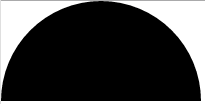

在(100,100)创建一个圆形，半径是100。属性clip-path引用了一个带单个rect元素的<clipPath>元素。它内部的这个矩形将把画布的上半部分涂黑。注意，clipPath元素经常放在一个defs元素内。

然而，该rect不会被绘制。它的象素数据将用来确定：** 圆形的哪些像素需要最终呈现出来**。因为矩形只覆盖了圆形的上半部分，所以下半部分将消失了：

### 遮罩
遮罩的效果最令人印象深刻的是表现为一个渐变。如果你想要让一个元素淡出，你可以利用遮罩效果实现这一点。
```xml
<svg version="1.1"
    xmlns="http://www.w3.org/2000/svg">
    <defs>
        <linearGradient id="Gradient">
            <stop offset="0" stop-color="white" stop-opacity="0" />
            <stop offset="1" stop-color="white" stop-opacity="1" />
        </linearGradient>
        <mask id="Mask">
            <rect x="0" y="100" width="200" height="200" fill="url(#Gradient)" />
        </mask>
    </defs>
    <rect x="0" y="100" width="200" height="200" fill="green" />
    <rect x="0" y="100" width="200" height="200" fill="red" mask="url(#Mask)" />
</svg>
```
显示效果：

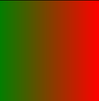

### 用opacity定义透明度
有一个简单方法可以用来为整个元素设置透明度。它就是opacity属性
```xml
<rect x="0" y="0" width="100" height="100" opacity=".5" />
```

还有两个分开的属性fill-opacity和stroke-opacity，分别用来控制填充和描边的不透明度。注意，描边将绘制在填充的上面。因此，如果你在元素上设置了一个描边透明度，它同时还有填充，则填充将在描边上透过一半，另一半背景也将出现：
```xml
<rect x="0" y="150" width="200" height="200" fill="blue" />
<circle cx="100" cy="450" r="50" stroke="yellow" stroke-width="40" stroke-opacity=".5" fill="red" />
```

2015-12-27
## 其他SVG内容

### 光栅图像
很像在HTML中的img元素，SVG有一个image元素，用于同样的目的。你可以利用它嵌入任意光栅（以及矢量）图像。它的规格要求应用至少支持PNG、JPG和SVG格式文件。

嵌入的图像变成一个普通的SVG元素。这意味着，你可以在其内容上用剪切、遮罩、滤镜、旋转以及其它SVG工具：
```xml
<svg version="1.1"
    xmlns="http://www.w3.org/2000/svg"
    xmlns:xlink="http://www.w3.org/1999/xlink"
    width="200"
    height="200">
    <image x="90" y="-65" width="128" height="146" transform="rotate(45)" xlink:href="https://developer.mozilla.org/static/img/mdn-logo.png" />
</svg>
```
其中image的图片的大小会根据image的width和height进行缩放。
显示效果：

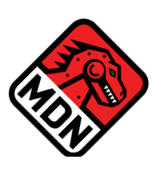

当宽度变为68时，显示效果如下：

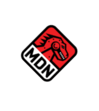

还有一些重要的事情需要注意：
> * 如果你没有设置x属性或y属性，它们自动被设置为0。
> * 如果你没有设置height属性或width属性，它们自动被设置为0。
> * 如果width属性或height等于0，将不会呈现这个图像。

源代码：[demo/demo8.svg](demo/demo8.svg)

### 嵌入任何xml
因为SVG是一个XML应用，所以你总是可以在SVG文档的任何位置嵌入任意XML。但是你没有必要定义周围的SVG需要怎样反作用于这个内容。实际上，在一个遵从的浏览者中，根本没有反作用的方法，数据将简单被忽略。因此特地在SVG中添加了<foreignObject> 元素。它的唯一的目的是作为其它标记的容器和SVG样式属性的载体（更突出的width和height用来定义该对象占用的空间。）。

foreignObject元素是一个好办法，用来在SVG中嵌入XHTML。如果你有更长的文本，该HTML布局比SVG text元素更适合。另一个经常被引用的用例是用MathML写的方程式。对于SVG的科学应用，它是连接两个世界的一个很好的办法。
因为foreignObject是一个SVG元素，所以你可以像用图像那样，使用任何SVG的精华，它将被应用到它的内容。

## SVG字体
当规定SVG时，在浏览器支持web字体并不流行。因为访问正确的字体文件对于正确呈现字体是有确定性的，SVG中添加了一个字体描述技术，以提供这个能力。它并不是为了和别的格式比如说PostScript或OTF兼容，而是为了将字形信息嵌入SVG呈现的一个简单的方法。
> **SVG字体当前只在Safari和Android浏览器中受支持。**
Internet Explorer还没有考虑实现它，Chrome 38（和Opera25）移除了这个功能，Firefox已经无限期推迟实施它以专心实现WOFF。别的工具比如说Adobe SVG Viewer插件、Batik和部分Inkscape支持SVG字体嵌入。
### 定义一个字体

在SVG中嵌入一个字体，有一些原料要求。让我们用一个示例演示它（来自[规范文档](http://www.w3.org/TR/SVG/fonts.html#FontElement)的示例），并详细解释。

2015-12-31
